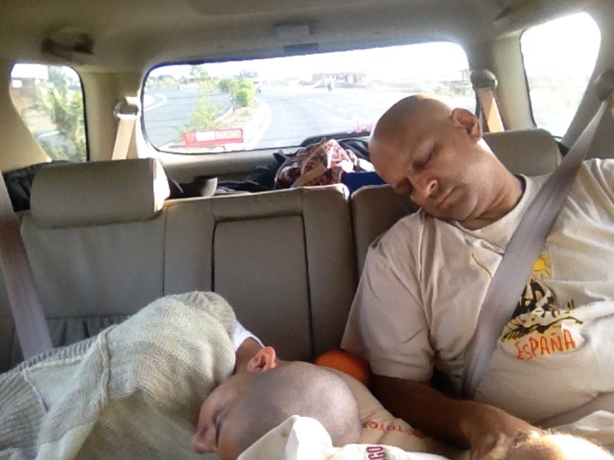
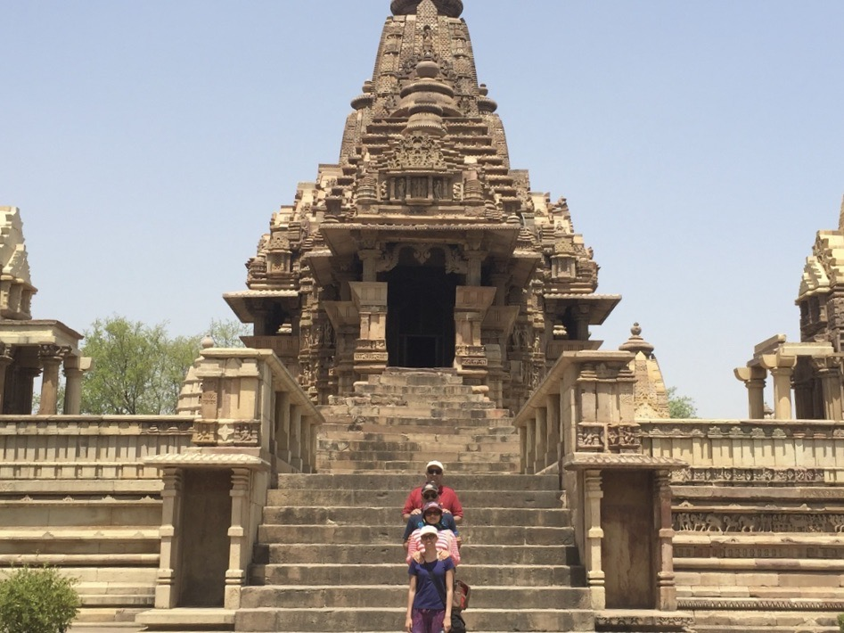
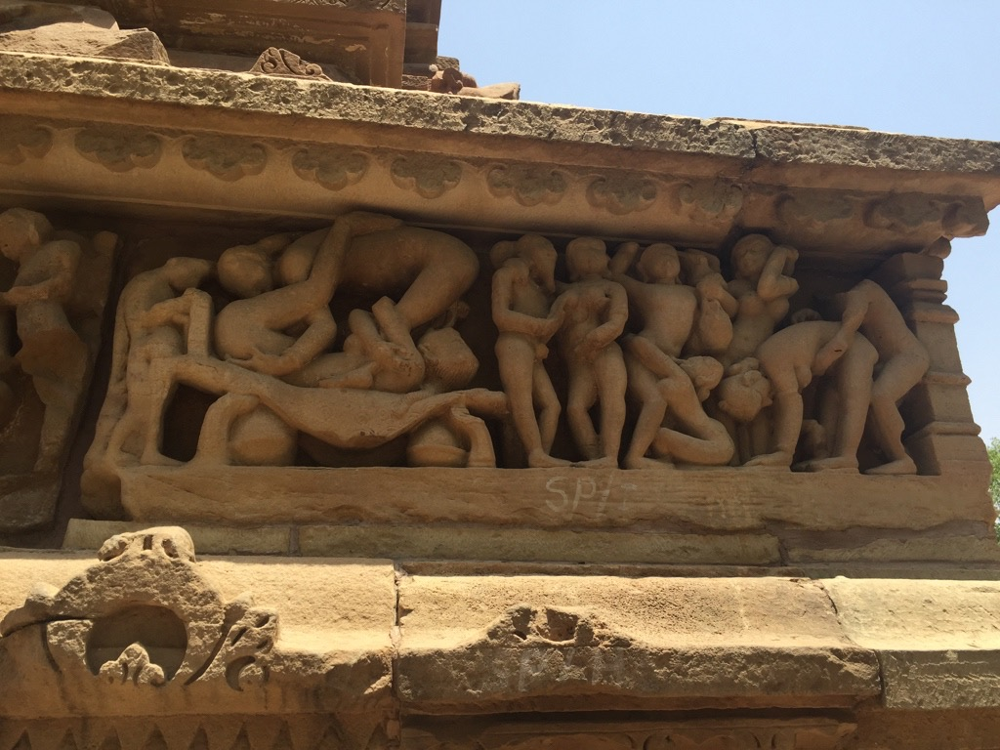
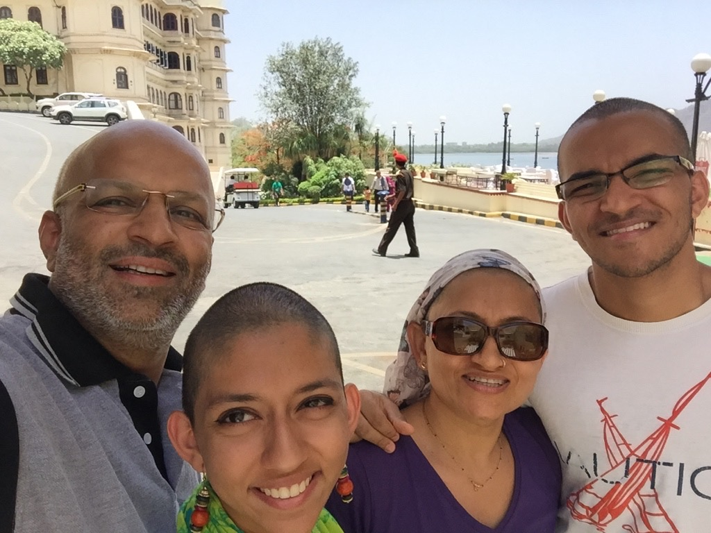

<i>Taken from a wee blog I had going in 2015</i>

It’s Day Numero 5 on our expedition across India. Our city-bodies are gradually becoming acclimatised to this hot yet wonderful environment. As the days progress, we are becoming more and more capable at navigating through the multitude of cows that grace the highways with their presence and even more used to the incredibly annoying drone of the GPS. Our tanned bodies and filthy car are testament to our five days in Central India.

We begun our journey from our humble abode in Mumbai to Indore to Bhopal to Khajuraho and, now, to the majestic city of Udaipur and so far this voyage has been all that we hoped for and more!

<figcaption align="right"><i>en Route</i></figcaption>

The city of Bhopal simply blew my mind. We began by visiting a couple of museums and when I say museums (in India), I wouldn’t really expect anything more than a massive dusty room with a couple of priceless yet neglected artifacts on display. Let’s face it – India is known for its history NOT for its museums. But boy was I wrong. Walking into the recently made Tribal Museum of Madhya Pradesh literally felt like we were entering a local village – but indoors! The amount of effort put into making this museum quite possibly paralleled Maharashtra’s enforcing of this beef ban! The indoor trees looked frighteningly real and the buildings actually transported you into the rural and tribal setting. The incredible thing is that this museum didn’t only stop at re-creating tribal conditions; it went ahead and made unbelievable artistic representations of local tales and rituals. The portrayal of a woman’s duties in marriage was flabbergasting. The artist took a bangle that is usually presented to the woman upon entering the husband’s family, made it big enough to fit on a GIANT and then added sculptures of all the activities that the woman was expected to do around the entire bangle. Incredible India…

The next day we visited this UNESCO site called Bhimbetka. Thinking that this is just another monument that we were going to check out, I quickly inserted my foot into my mouth. Bhimbetka, in fact, is the location of some of the earliest cave paintings of man ever observed in all of the world – coming after France and Spain (from my recollection). I just stood at the site of one of those caves thinking to myself that thirty thousand or so years ago, a hairy caveman and his equally hairy cavewoman used to actually inhabit this location. Even though I make it sound amusing, it was honestly quite chilling and humbling. The very walls made me feel honoured to be in its presence because they allowed me to visually see human evolution taking place through the artistic development of the paintings! This was the epitome of history and the best part was that it was in India!

For the sake of brevity I will move on to Khajuraho – the City of Sex. Khajuraho, famed for its ‘erotic’ temples, piqued the interest of my mother – a sex ed. teacher – and her son – a teenage boy. When we finally decided to embark on this conquest of ancient Hindu sexual knowledge, we found ourselves dragging along our feet under the blazing hot 12 o’clock sun (mind you, it averaged 45 degrees Celsius). Spurned on by the desire to view excessively eroticized sculptures, I found myself staring at a sexually-engaged couple thinking, “This is pretty thanda compared to Game of Thrones.”

But just when I found my attention dwindling, our Spanish-speaking tour guide came to the rescue with his phenomenal ability to capture the essence of the sculptures in his creative words that deserve a place in a Comedy Club! As the hour wore on, he logically related breasts to ‘lemons, oranges and papaya’, he briefly explained how holding mangoes and a parrot implied that one is a prostitute and he eloquently called ejaculation, ‘the discharging of batteries’! We obviously picked up some information on Lord Vishnu and Shiva and were able to witness some incredible architecture but our guide, Bharat, was the cherry on the icing on our cake.

Today, we reached the grandiose city of Udaipur at the tail end of a ten hour ride which entailed passing through Kota – a city solely filled with IIT schools and accommodation for the students attending these IIT school, passing by Hard Rock Café’s Indian doppelgänger – Café Rock Star and seeing a restaurant, called Al-Hyatt, sponging off the successful Hyatt hotel chain. Udaipur as well as all the forts that we have visited is magnificent with architecture that humbles its beholders.

Couple of Observations:

We are travelling through central India at a time in which a heat wave has just killed around 2000 people. Yet we are fine. Makes you think about how much socio-economic conditions matter doesn’t it?
Sure the forts and palaces are fantastic to view and to visit. The history of how they have come into being also garners a chapter in the annals of history. But what is not documented or even thought of enough is the amount of slave labour that has gone into the construction of all around and within these battlements. Shame.
Anyway, time to pass out now after a long and tiring day of sitting in a car for 10 hours and munching on granola bars, Domino’s Pizza and Oreos. Can’t wait to wake up to the sun rising across the azure of the Pichola Lake.

Bye for now!